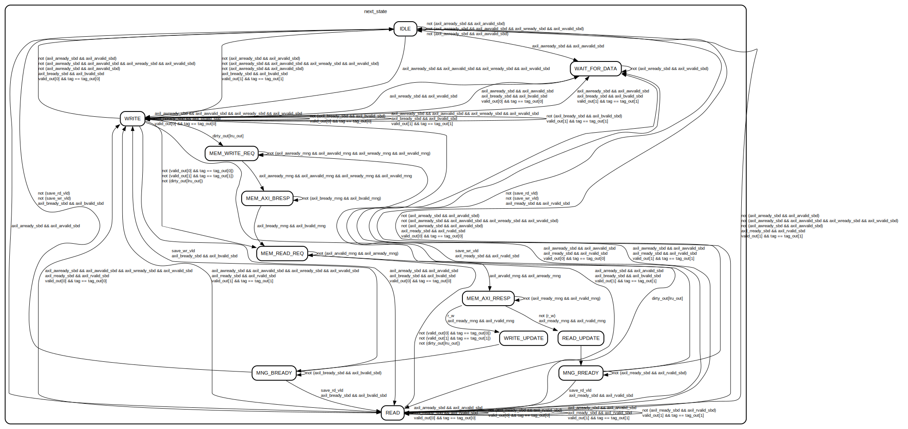

# Entity: cache 
- **File**: cache.sv

## Diagram

## Ports

| Port name        | Direction | Type   | Description |
| ---------------- | --------- | ------ | ----------- |
| clk              | input     |        |             |
| rst_n            | input     |        |             |
| axil_awaddr_sbd  | input     | [31:0] |             |
| axil_awvalid_sbd | input     |        |             |
| axil_awready_sbd | output    |        |             |
| axil_wdata_sbd   | input     | [31:0] |             |
| axil_wvalid_sbd  | input     |        |             |
| axil_wready_sbd  | output    |        |             |
| axil_bresp_sbd   | output    | [1:0]  |             |
| axil_bvalid_sbd  | output    |        |             |
| axil_bready_sbd  | input     |        |             |
| axil_araddr_sbd  | input     | [31:0] |             |
| axil_arvalid_sbd | input     |        |             |
| axil_arready_sbd | output    |        |             |
| axil_rdata_sbd   | output    | [31:0] |             |
| axil_rvalid_sbd  | output    |        |             |
| axil_rresp_sbd   | output    | [1:0]  |             |
| axil_rready_sbd  | input     |        |             |
| axil_awaddr_mng  | output    | [31:0] |             |
| axil_awvalid_mng | output    |        |             |
| axil_awready_mng | input     |        |             |
| axil_wdata_mng   | output    | [31:0] |             |
| axil_wvalid_mng  | output    |        |             |
| axil_wready_mng  | input     |        |             |
| axil_bresp_mng   | input     | [1:0]  |             |
| axil_bvalid_mng  | input     |        |             |
| axil_bready_mng  | output    |        |             |
| axil_araddr_mng  | output    | [31:0] |             |
| axil_arvalid_mng | output    |        |             |
| axil_arready_mng | input     |        |             |
| axil_rdata_mng   | input     | [31:0] |             |
| axil_rresp_mng   | input     | [1:0]  |             |
| axil_rvalid_mng  | input     |        |             |
| axil_rready_mng  | output    |        |             |

## Signals

| Name                  | Type                     | Description |
| --------------------- | ------------------------ | ----------- |
| data_addr             | logic [INDEX - 1 : 0]    |             |
| read_enable[2]        | logic                    |             |
| data_out[2]           | logic [31 : 0]           |             |
| data_in[2]            | logic [31 : 0]           |             |
| write_enable[2]       | logic                    |             |
| tag_addr              | logic [INDEX - 1 : 0]    |             |
| tag_read_enable[2]    | logic                    |             |
| tag_out[2]            | logic [TAG_SIZE - 1 : 0] |             |
| tag_in[2]             | logic [TAG_SIZE - 1 : 0] |             |
| tag_write_enable[2]   | logic                    |             |
| valid_addr            | logic [INDEX - 1 : 0]    |             |
| valid_read_enable[2]  | logic                    |             |
| valid_out[2]          | logic                    |             |
| valid_in[2]           | logic                    |             |
| valid_write_enable[2] | logic                    |             |
| lru_addr              | logic [INDEX - 1 : 0]    |             |
| lru_read_enable       | logic                    |             |
| lru_out               | logic                    |             |
| lru_in                | logic                    |             |
| lru_write_enable      | logic                    |             |
| dirty_addr            | logic [INDEX - 1 : 0]    |             |
| dirty_read_enable[2]  | logic                    |             |
| dirty_out[2]          | logic                    |             |
| dirty_in[2]           | logic                    |             |
| dirty_write_enable[2] | logic                    |             |
| read_address          | reg [31:0]               |             |
| next_read_address     | logic [31:0]             |             |
| write_address         | reg [31:0]               |             |
| next_write_address    | logic [31:0]             |             |
| write_data            | reg [31:0]               |             |
| next_write_data       | logic [31:0]             |             |
| tag                   | reg [TAG_SIZE - 1 : 0]   |             |
| next_tag              | logic [TAG_SIZE - 1 : 0] |             |
| index                 | reg [INDEX - 1 : 0]      |             |
| next_index            | logic [INDEX - 1 : 0]    |             |
| lru_way               | reg                      |             |
| next_lru_way          | logic                    |             |
| r_w                   | reg                      |             |
| next_r_w              | logic                    |             |
| writeback_data        | reg [31:0]               |             |
| next_writeback_data   | logic [31:0]             |             |
| fetched_data          | reg [31:0]               |             |
| next_fetched_data     | logic [31:0]             |             |

## Constants

| Name        | Type | Value                               | Description |
| ----------- | ---- | ----------------------------------- | ----------- |
| BYTE_WIDTH  |      | 8                                   |             |
| SIZE        |      | 32768                               |             |
| BLOCK_SIZE  |      | 1                                   |             |
| WAYS        |      | 2                                   |             |
| CACHE_LINES |      | ((SIZE*BYTE_WIDTH)/(BLOCK_SIZE*32)) |             |
| OFFSET      |      | (BLOCK_SIZE * 32 / BYTE_WIDTH)      |             |
| INDEX       |      | CACHE_LINES - clog2(WAYS)           |             |
| TAG_SIZE    |      | 32 - INDEX - OFFSET                 |             |

## Types

| Name   | Type                                                                                                                                                                                                                                                                                                                                                                                                                                                                                                                                                                                                                                                                                                                                                                                                                                                                                                                                                                                                                                                                      | Description |
| ------ | ------------------------------------------------------------------------------------------------------------------------------------------------------------------------------------------------------------------------------------------------------------------------------------------------------------------------------------------------------------------------------------------------------------------------------------------------------------------------------------------------------------------------------------------------------------------------------------------------------------------------------------------------------------------------------------------------------------------------------------------------------------------------------------------------------------------------------------------------------------------------------------------------------------------------------------------------------------------------------------------------------------------------------------------------------------------------- | ----------- |
| states | enum logic [3:0] {   IDLE  = 4'h0,                                  WAIT_FOR_DATA = 4'h1,                                  READ = 4'h2,                                  WRITE = 4'h3,                                  MEM_READ_REQ = 4'h4,                                  MEM_AXI_RRESP = 4'h5,                                  MEM_WRITE_REQ = 4'h6,                                  MEM_AXI_BRESP = 4'h7,                                  READ_UPDATE = 4'h8,                                  WRITE_UPDATE = 4'h9,                                  MNG_RREADY = 4'hA,                                  MNG_BREADY = 4'hB } |             |

## Processes
- axi_interface: (  )
  - **Type:** always_comb
- unnamed: ( @(posedge clk) )
  - **Type:** always_ff
- unnamed: ( @(posedge clk) )
  - **Type:** always_ff
- unnamed: ( @(posedge clk) )
  - **Type:** always_ff
- unnamed: ( @(posedge clk) )
  - **Type:** always_ff
- unnamed: ( @(posedge clk) )
  - **Type:** always_ff
- unnamed: ( @(posedge clk) )
  - **Type:** always_ff
- unnamed: ( @(posedge clk) )
  - **Type:** always_ff
- unnamed: ( @( posedge clk ) )
  - **Type:** always_ff
- unnamed: ( @( posedge clk ) )
  - **Type:** always_ff
- state_datapath: (  )
  - **Type:** always_comb

## Instantiations

- data_ram_0: sram
- data_ram_1: sram
- tag_ram_0: sram
- tag_ram_1: sram
- valid_ram_0: sram
- valid_ram_1: sram
- lru_ram: sram
- dirty_ram_0: sram
- valid_ram_1: sram

## State machines

